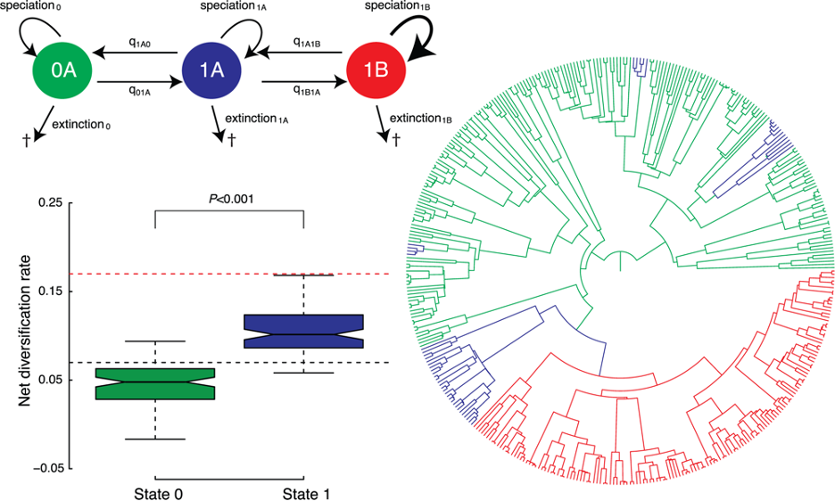

## Favorite parasite

    

<b>Parasitic barnacle (<em>Heterosaccus californicus</em>) 
Sheep crab (<em>Loxorhynchus grandis</em>)</b> 
Photo by Anand Varma, "Mindsuckers" 
National Geographic (2014)

---

## How may parasites evade coextinction?

- Be less virulent
- Promote host reproduction
- Be less host-specific
- Evolve faster

---

## Gene tree-species tree evolution

- Based on Duplication-Transfer-Loss model 
- Duplication ~ parasite speciation Transfer ~ host-shift Loss ~ parasite extinction

 

`DTL will underestimate transfer events under escape-and-radiate`

Satler et al (2019) Dismukes et al (2020)

---

## Discrete biogegraphy

- Host tree
- Parasite tree
- Interaction  matrix

Braga et al (2020)

---

## Models of diversification

<b>BiSSE</b>

Code HP as binary vector of length(number of H)

Maddison, Midford, & Otto (2007)

---

## Models of diversification

<b>BiSSE</b>

Code HP as binary vector of length(number of H)

- `Branches descending from nodes with fewer parasite associations occupy the accelerated rate class`
- `Overestimate significance`

Maddison, Midford, & Otto (2007)

---

## Models of diversification

<b>HiSSE</b>

Figure directly from Beaulieu & O’Meara (2016)

Rabosky and Goldberg (2017)

---

## Models of diversification

<b>HiSSE</b>

Figure directly from Beaulieu & O’Meara (2016)

- `Low power` 
`to detect`  
`trait-dependent` 
`extinction`  
- `Infer changes in` 
`rate classes w/` 
`greater certainty` 
`for H than P`

Rabosky and Goldberg (2017)

---

## Models of diversification

<b>Geo(Hi)SSE</b>

Likelihood calculated using DEC only reflects evolution of ranges (host-repertoires) and treats trees as fixed, which can be problematic when jump dispersal events are allowed

- Apply geographic SSE models: `GeoSSE`
- Allow geographic range evolution independent of focal trait: `GeoHiSSE`

Caetano, O'Meara, & Beaulieu (2018) Ree & Sanmartin (2018) Goldberg, Lancaster, & Ree (2011)

---

## Models of diversification

<b>Geo(Hi)SSE</b>

Likelihood calculated using DEC only reflects evolution of ranges (host-repertoires) and treats trees as fixed, which can be problematic when jump dispersal events are allowed

- Apply geographic SSE models: `GeoSSE`
- Allow geographic range evolution independent of focal trait: `GeoHiSSE`

`GeoHiSSE will reconstruct coevolution under escape-and-radiate most accurately`

Caetano, O'Meara, & Beaulieu (2018) Ree & Sanmartin (2018) Goldberg, Lancaster, & Ree (2011)

## Models of diversification

<b>HiSSE</b>

Diversification models that do not account for unmeasured traits are inappropriate to assess relationships between mutualism and ant diversification

- Rejected cooperate-and-radiate
- Lineages first radiated, then evolved plant mutualism

Kaur et al (2019)

---

## Models of diversification

<b>MuSSE</b>

- Allow exploration of interactive effects of traits
- Include category such as host-specificity or counterdefense arsenal

Test for interaction btwn chemical defense and conspicuous coloration on diversification. Found chemical defense also increased extinction rate, leading to lower net diversification. Argue escape-and-radiate only includes speciation, neglecting extinction dynamics.

Arbuckle & Speed (2015)

---

## Interpreting simulation model results

- Statistical power determined by replications, and simulations can have high replications (p-val tiny)
- Null hyp known to be false at the outset
- Testing a known-to-be-falses hypothesis is not useful
- Better: comparing magnitude of differences btwn sims
- Suggested: Komolgorov-Smirnov test to compare two distribution generated by data; focus on effect size or test statistic
- ANOVA useful for partitioning variance and calc effects sizes - don't report p-val

White et al (2014)

