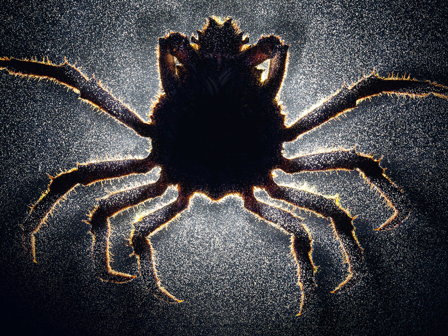
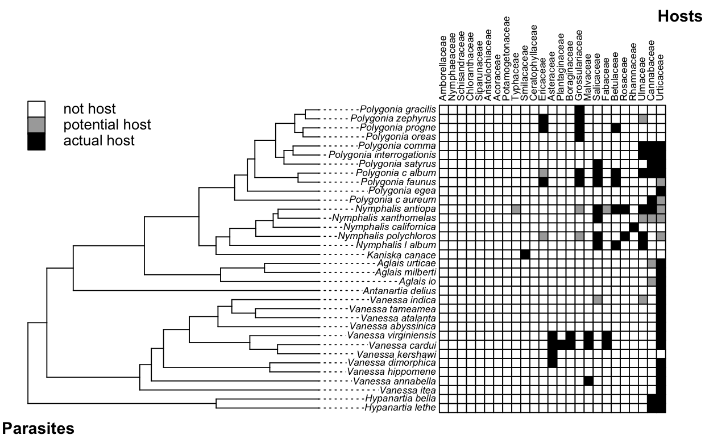

## Favorite parasite

    

<b>Parasitic barnacle (<em>Heterosaccus californicus</em>) 
Sheep crab (<em>Loxorhynchus grandis</em>)</b> 
Photo by Anand Varma, "Mindsuckers" 
National Geographic (2014)

---

## Discrete biogegraphy

- Host tree
- Parasite tree
- Interaction  matrix

Braga et al (2020)

---

## Models of diversification

<b>HiSSE</b>

Diversification models that do not account for unmeasured traits are inappropriate to assess relationships between mutualism and ant diversification

- Rejected cooperate-and-radiate
- Lineages first radiated, then evolved plant mutualism

Kaur et al (2019)

---

## Models of diversification

<b>MuSSE</b>

- Allow exploration of interactive effects of traits
- Include category such as host-specificity or counterdefense arsenal

Test for interaction btwn chemical defense and conspicuous coloration on diversification. Found chemical defense also increased extinction rate, leading to lower net diversification. Argue escape-and-radiate only includes speciation, neglecting extinction dynamics.

Arbuckle & Speed (2015)

---

## Interpreting simulation model results

- Statistical power determined by replications, and simulations can have high replications (p-val tiny)
- Null hyp known to be false at the outset
- Testing a known-to-be-falses hypothesis is not useful
- Better: comparing magnitude of differences btwn sims
- Suggested: Komolgorov-Smirnov test to compare two distribution generated by data; focus on effect size or test statistic
- ANOVA useful for partitioning variance and calc effects sizes - don't report p-val

White et al (2014)

