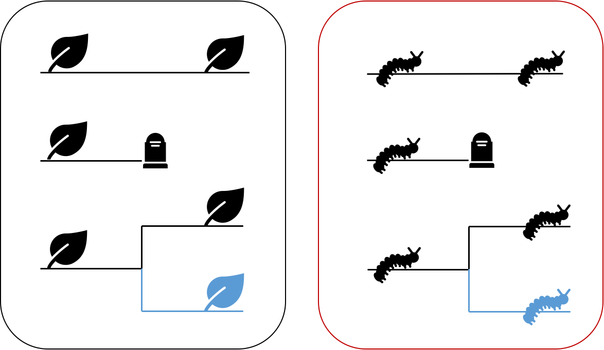
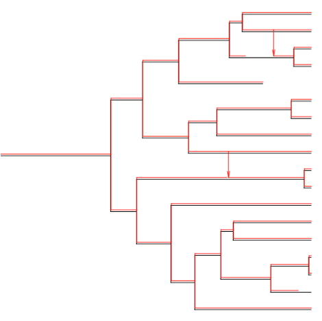
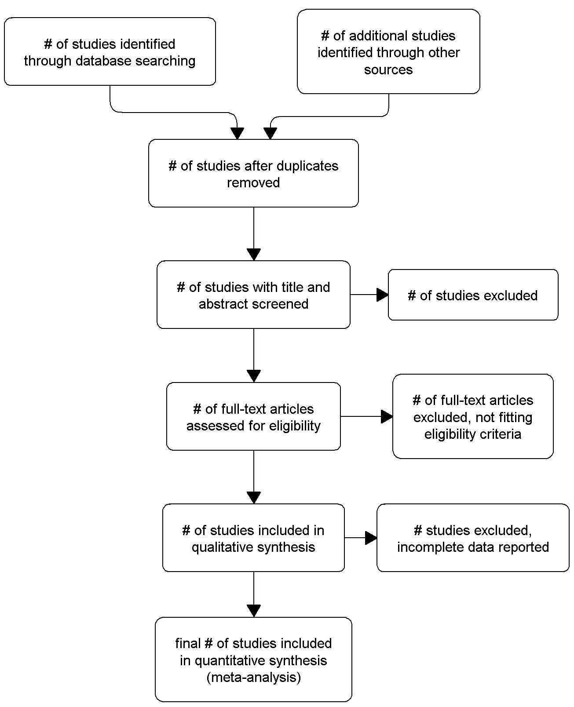
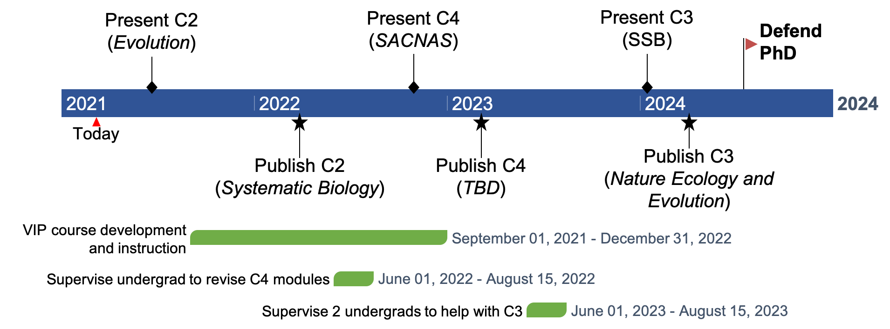

## Outline

> 1. Introduction 
> 2. Developing a new model for a classic hypothesis
> 3. Quantifying the role of coevolution in lineage diversification
> 4. Software process meets the scientific method
> 5. Considerations
> 6. Summary

--- .segue h2 bg:darkslategray

## Introduction

--- 

## Big questions

> - How do ecological interactions shape the diversification of life?
> - Why is parasitism so ubiquitous despite obvious harm to host?

<div style="position: absolute; bottom: 4em; left: 5em; font-weight: bold; color: #fff; font-size: 11px;">
<p style="font-size: 20px">Weinstein & Kuris (2016)<br>Ehrlich and Raven (1964)</p>
</div>

--- 

## Big questions

- How do ecological interactions shape the diversification of life?
- Why is parasitism so ubiquitous despite obvious harm to host?

<br>

```{r powerful-caterpillar, fig.show='hold', out.width="60%", echo=FALSE, fig.align = 'center'}

knitr::include_graphics('assets/img/arms-race.png')
```

<div style="position: absolute; bottom: 4em; left: 5em; font-weight: bold; color: #fff; font-size: 11px;">
<p style="font-size: 20px">Weinstein & Kuris (2016)<br>Ehrlich and Raven (1964)</p>
</div>

--- 

## Problem

- Cool to think about but hard to study

> - <b>No quantitative macro-coevolutionary model</b>

---

## Problem

- Cool to think about but hard to study
- <b>No quantitative macro-coevolutionary model</b>

<br>

## Conventional approaches

- Test degree of congruence between parasite and host phylogenies
- Map parasite phylogeny onto host phylogeny

> - <b>Neglect reciprocal selective pressures</b>

--- 

## Escape-and-radiate coevolution

<div style="position: absolute; bottom: 5em; left: 5em; font-weight: bold; color: #fff; font-size: 11px;">
<p style="font-size: 20px">Ehrlich and Raven (1964)<br>Thompson (1989) </p>
</div>

--- &twocol

## Escape-and-radiate coevolution

> "In escape-and-radiate coevolution, coevolution happens at key moments to drive the evolution of plant defenses and insect counter-defenses, and then other speciation processes (e.g., allopatric speciation) come into play as plants and insects increase their geographic ranges or further subdivide resources."
>
>  &mdash; Althoff, Segraves, and Johnson (2014)

<div style="position: absolute; bottom: 5em; left: 5em; font-weight: bold; color: #fff; font-size: 11px;">
<p style="font-size: 20px">Ehrlich and Raven (1964)<br>Thompson (1989) </p>
</div>

--- &twocol

## Escape-and-radiate coevolution

> "In escape-and-radiate coevolution, coevolution happens at key moments to drive the evolution of plant defenses and insect counter-defenses, and then other speciation processes (e.g., allopatric speciation) come into play as plants and insects increase their geographic ranges or further subdivide resources."
>
>  &mdash; Althoff, Segraves, and Johnson (2014)

*** {name: left}

<H3 align="left">Let's say we start with</H3>

<div style="position: absolute; bottom: 5em; left: 5em; font-weight: bold; color: #fff; font-size: 11px;">
<p style="font-size: 20px">Ehrlich and Raven (1964)<br>Thompson (1989) </p>
</div>

--- &twocol

## Escape-and-radiate coevolution

> "In escape-and-radiate coevolution, coevolution happens at key moments to drive the evolution of plant defenses and insect counter-defenses, and then other speciation processes (e.g., allopatric speciation) come into play as plants and insects increase their geographic ranges or further subdivide resources."
>
>  &mdash; Althoff, Segraves, and Johnson (2014)

*** {name: left}

<H3 align="left">Let's say we start with</H3>


*** {name: right}
### Potential scenario

<div style="position: absolute; bottom: 5em; left: 5em; font-weight: bold; color: #fff; font-size: 11px;">
<p style="font-size: 20px">Ehrlich and Raven (1964)<br>Thompson (1989) </p>
</div>

--- .segue h2 bg:darkslategray

## Developing a new model for a classic hypothesis

---

## Objectives

1. Develop a novel quantitative model of escape-and-radiate coevolution
2. Generate testable macroevolutionary predictions under escape-and-radiate coevolution

---

## Model description

<b>Possible evolutionary events</b>




--- &twocol

## Model description

<b>Possible coevolutionary scenario</b>

*** =left

> - P extinction &#8594; H "escape"
> - P host-shift &#8594; P "escape"

*** =right


---

## Quantitative model for escape-and-radiate 

- M0: Host speciation independent of parasite extinction
- M1: Host speciation higher after parasite extinction

---

## Quantitative model for escape-and-radiate 

- M0: Host speciation independent of parasite extinction
- M1: Host speciation higher after parasite extinction

<br> 

## Methods

- Develop new `R` package: `coevolve`
- Simulate host-parasite coevolution: `cophy`

<div style="position: absolute; bottom: 5em; left: 5em; font-weight: bold; color: #fff; font-size: 11px;">
<p style="font-size: 20px">Engelstadter & Fortuna (2019)</p>
</div>

--- &twocol

## Proof of concept

<div style="position: absolute; bottom: 5em; left: 5em; font-weight: bold; color: #fff; font-size: 11px;">
<p style="font-size: 20px">Simulations performed in `cophy`<br>
$\kappa = 0$, $\theta_S = 0.1$, $\beta = 0$<br>
Top: $\nu = 0$<br>
Bottom: $\nu = 2$</p>
</div>

*** =left

- Assume we have a powerful parasite
- Higher prob(parasite extinction) &#8594; Greater host diversity

*** =right

--- &twocol

## Proof of concept

<div style="position: absolute; bottom: 5em; left: 5em; font-weight: bold; color: #fff; font-size: 11px;">
<p style="font-size: 20px">Simulations performed in `cophy`<br>
$\kappa = 0$, $\theta_S = 0.1$, $\beta = 0$<br>
Top: $\nu = 0$<br>
Bottom: $\nu = 2$</p>
</div>

*** =left

- Assume we have a powerful parasite
- Higher prob(parasite extinction) &#8594; Greater host diversity

*** =right


---

## Generate testable macroevolutionary predictions under escape-and-radiate coevolution

1. Simulate datasets under null and escape-and-radiate models 
2. Analyze datasets using suite of coevolutionary methods 
3. Evaluate to what extent methods can tell them apart

---

## Time-split

Compare summary statistics before and after "escape" events & overall 

- Diversification rate ($r$) ` `
- Relative extinction rate ($\epsilon$) ` `
- Lineage through time plots ` `
- Tree shape summary stats: `RPANDA` ` `

<div style="position: absolute; bottom: 4em; left: 5em; font-weight: bold; color: #fff; font-size: 11px;">
<p style="font-size: 20px">Morlon et al (2016)</p>
</div>

---

## Time-split


Compare summary statistics before and after "escape" events & overall 

- Diversification rate ($r$) - `similar overall; higher after "escape"`
- Relative extinction rate ($\epsilon$) - `higher under escape-and-radiate`
- Lineage through time plots - `more "bursts"`
- Tree shape summary stats: `RPANDA` 
    - `trees less balanced, more pectinate`
    - `escape-and-radiate events fall out as peaks in spectral densities`

<div style="position: absolute; bottom: 4em; left: 5em; font-weight: bold; color: #fff; font-size: 11px;">
<p style="font-size: 20px">Morlon et al (2016)</p>
</div>

--- 

## Cophylogeny reconstruction

<b>Distance-based</b>


<div style="position: absolute; top: 2em; right: 5em; font-weight: bold; color: #fff; font-size: 11px;">
<p style="font-size: 20px">Balbuena et al (2013)<br>Hutchinson et al (2017)</p>
</div>

--- 

## Cophylogeny reconstruction

<b>Distance-based</b>


<div style="position: absolute; top: 2em; right: 5em; font-weight: bold; color: #fff; font-size: 11px;">
<p style="font-size: 20px">Balbuena et al (2013)<br>Hutchinson et al (2017)</p>
</div>

<br><br>

`Greater phylogenetic`<br>
`congruence under` <br>
`escape-and-radiate`

---

## Cophylogeny reconstruction

<b>Event-based</b>

<div style="position: absolute; top: 2em; right: 5em; font-weight: bold; color: #fff; font-size: 11px;">
<p style="font-size: 20px">Engelstadter & Fortuna (2019)<br>Conow et al (2010)</p>
</div>




<br><br><br><br><br><br>

---

## Cophylogeny reconstruction

<b>Event-based</b>

<div style="position: absolute; top: 2em; right: 5em; font-weight: bold; color: #fff; font-size: 11px;">
<p style="font-size: 20px">Engelstadter & Fortuna (2019)<br>Conow et al (2010)</p>
</div>


<br><br><br><br><br><br>

- `Host-shift events will be underestimated`
- `Same for gene tree-species tree methods`

<div style="position: absolute; bottom: 4em; left: 5em; font-weight: bold; color: #fff; font-size: 11px;" align="left">
<p style="font-size: 20px">Satler et al (2019)</p>
</div>

--- 

## Discrete biogeography

- Extirpation ~ Host-resistance <br>Dispersal ~ New host


<div style="position: absolute; top: 1em; right: 5em; font-weight: bold; color: #fff; font-size: 11px;">
<p style="font-size: 20px">Braga et al (2020, 2021); Hardy (2016)<br>Kaczvinsky & Hardy (2020)</p>
</div>

--- 

## Discrete biogeography

- Extirpation ~ Host-resistance <br>Dispersal ~ New host
<br>

- `"Escape" events coupled` <br>
`with cladogenetic` <br>
`("radiation") events`

- `Host-repertoire` <br>
`evolution higher`


<div style="position: absolute; top: 1em; right: 5em; font-weight: bold; color: #fff; font-size: 11px;">
<p style="font-size: 20px"">Braga et al (2020, 2021); Hardy (2016)<br>Kaczvinsky & Hardy (2020)</p>
</div>

--- 

## Models of diversification

<b>BiSSE, HiSSE, Geo(Hi)SSE</b>

Possible rate classes:

1. base rate class
2. accelerated rate class

--- &twocol

## Models of diversification

*** =left

<b>BiSSE, HiSSE, Geo(Hi)SSE</b>

Possible rate classes:

1. base rate class
2. accelerated rate class

*** =right

- `Host enters accelerated rate class after successful "escape" event`
- `GeoHiSSE reconstructs coevolution under escape-and-radiate most accurately`
- `Changes in rate classes inferred w/ greater certainty for H than P`

<div style="position: absolute; bottom: 7em; left: 5em; font-weight: bold; color: #fff; font-size: 11px;">
<p style="font-size: 20px">Maddison, Midford, & Otto (2007)<br>
Goldberg, Lancaster, & Ree (2011)
<br>Beaulieu & O’Meara (2016)
<br>Rabosky and Goldberg (2017)
<br>Ree & Sanmartin (2018)
<br>Caetano, O'Meara, & Beaulieu (2018)</p>
</div>

---

## Put it all together, what do we get?

> - Comparison of cophylogenetic methods
> - Confidence in which methods would detect escape-and-radiate, if real
> - Foundation for cophylogenetic comparative framework

--- .segue h2 bg:darkslategray

## Quantifying the role of coevolution <br>in lineage diversification

---

## Background

- Few phylogenetic studies interpret their observations through lens of coevolutionary theory
- Coevolutionary theory generates interesting predictions

---

## Background

- Few phylogenetic studies interpret their observations through lens of coevolutionary theory
- Coevolutionary theory generates interesting predictions

## Hypotheses

1. Antagonistic coevolution promotes lineage diversification
2. Mutualistic coevolution does not promote, and may even restrict, the diversification of species

<div style="position: absolute; bottom: 4em; left: 5em; font-weight: bold; color: #fff; font-size: 11px;">
<p style="font-size: 20px">Yoder & Nuismer (2010)</p>
</div>

---

## Good news

Many publicly available datasets exist to test these exciting predictions 

<br>

---

## Good news

Many publicly available datasets exist to test these exciting predictions 

<br>

## Objective

Quantify the effect of coevolution on lineage diversification using phylogenetic meta-analysis

---

## Synthesis<br>workflow

- Preferred Reporting Items for <br>
Systematic Review and <br>
Meta-Analysis (PRISMA) protocol
- `metagear`
- Criteria for conducting <br>transparent meta-analyses on <br>open data



<div style="position: absolute; bottom: 5em; left: 5em; font-weight: bold; color: #fff; font-size: 11px;">
<p style="font-size: 20px">Moher et al (2015)<br>Lajeunesse (2016)<br>Culina et al (2018)</p>
</div>

---

## Scoping 

- Two monophyletic groups A and B 
- Open Tree of Life
- Interaction Web Database
- Global Biotic Interactions

<div style="position: absolute; bottom: 5em; left: 5em; font-weight: bold; color: #fff; font-size: 11px;">
<p style="font-size: 20px">https://tree.opentreeoflife.org<br>
https://iwdb.nceas.ucsb.edu/<br>
https://www.globalbioticinteractions.org/
</p>
</div>

---

## Searching

- Develop search terms (Librarian &#10003;)
- Validate search terms using Zeng & Wiens (2021)

---

## Screening

- Recruit help!  (GEM3 SARE funding x2)
- `metagear`: `effort_distribute`, `abstract_screener`

<div style="position: absolute; bottom: 5em; left: 5em; font-weight: bold; color: #fff; font-size: 11px;">
<p style="font-size: 20px">Lajeunesse (2016)</p>
</div>

---

## Coding and extracting data

- Open Tree of Life in `R`: `rotl`
- Estimate speciation and extinction rates: `GeoHiSSE`
- Repeat analyses in Zeng and Wiens (2021)

<div style="position: absolute; bottom: 5em; left: 5em; font-weight: bold; color: #fff; font-size: 11px;">
<p style="font-size: 20px">Michonneau, Brown, & Winter (2016)<br>Caetano, O'Meara, & Beaulieu (2018)</p>
</div>

---

## Traditional meta-analysis

- Goal: get average weighted effect size
- Evaluate homogeneity of effect sizes and test for bias

<div style="position: absolute; bottom: 5em; left: 5em; font-weight: bold; color: #fff; font-size: 11px;">
<p style="font-size: 20px">Reviewed in Lajeunesse (2011)</p>
</div>

---

## Traditional meta-analysis

- Goal: get average weighted effect size
- Evaluate homogeneity of effect sizes and test for bias

## Effect size

Binary log-response ratio 

$$\log_2(R)$$

$R$ is ratio of the two diversification rates

<div style="position: absolute; bottom: 5em; left: 5em; font-weight: bold; color: #fff; font-size: 11px;">
<p style="font-size: 20px">Zeng and Wiens (2021)<br>Reviewed in Lajeunesse (2011)</p>
</div>

---

## Sources of heterogeneity

- Include potential covariates (e.g, $\epsilon$, is it a plant, is it a host, genome size)
- Divergence time estimates: TimeTree
- Phylogenetic similarity: `paco`

<div style="position: absolute; bottom: 5em; left: 5em; font-weight: bold; color: #fff; font-size: 11px;">
<p style="font-size: 20px">Kumar et al (2017)<br>Hutchinson et al (2017)</p>
</div>

---

## Phylogenetic meta-analysis

- Additional source of bias: pooling effect size data from multiple taxa 
- Account for phylogenetic correlations among effect sizes: `PhyloMeta` and `metagear`
- Based on the generalized least squares (GLS) approach

<div style="position: absolute; bottom: 5em; left: 5em; font-weight: bold; color: #fff; font-size: 11px;">
<p style="font-size: 20px">Adams (2008)<br>Lajeunesse (2009,2011,2016)</p>
</div>

---

## Phylogenetic meta-analysis

Effects sizes are pooled, weighted by variance-covariance matrix $W$

$$
W = DPD
$$
If $P$ is identity matrix, then studies are independent

Otherwise, $P$ diagonal matrix of phylogenetic correlations

<div style="position: absolute; bottom: 5em; left: 5em; font-weight: bold; color: #fff; font-size: 11px;">
<p style="font-size: 20px">Lajeunesse (2009)</p>
</div>

---

## Phylogenetic meta-analysis

Effects sizes are pooled, weighted by variance-covariance matrix $W$

$$
W = DPD
$$
If $P$ is identity matrix, then studies are independent

Otherwise, $P$ diagonal matrix of `phylogenetic correlations` - &#x26A0;

<div style="position: absolute; bottom: 5em; left: 5em; font-weight: bold; color: #fff; font-size: 11px;">
<p style="font-size: 20px">Lajeunesse (2009)</p>
</div>

---

## Focus on one partner

- Test importance of type of interaction as predictor of diversification
- Phylogenetic divergence btwn interacting phylogenetics, taxonomic identity, relationship to partner, relative extinction rates

<div style="position: absolute; bottom: 5em; left: 5em; font-weight: bold; color: #fff; font-size: 11px;">
<p style="font-size: 20px">Carmona, Lajeunesse, & Johnson (2011)</p>
</div>

---

## Focus on one partner

- Test importance of type of interaction as predictor of diversification
- Phylogenetic divergence btwn interacting phylogenetics, taxonomic identity, relationship to partner, relative extinction rates

- `Parasitism affects diversification differently in` 
    - `Plants than animals`
    - `Hosts than parasites`
- `Extinction is important under escape-and-radiate`

<div style="position: absolute; bottom: 5em; left: 5em; font-weight: bold; color: #fff; font-size: 11px;">
<p style="font-size: 20px">Carmona, Lajeunesse, & Johnson (2011)</p>
</div>

--- .segue h2 bg:darkslategray

## Software process meets the scientific method

---

## A train-the-trainer model of computational empowerment for biologists

- Technology &#8594; data!
- Cumbersome datasets
- Foundational computational tools &#10003;


---

## A train-the-trainer model of computational empowerment for biologists

- Technology &#8594; data!
- Cumbersome datasets
- Foundational computational tools &#10003;

## Problem

No practical experience integrating software process into scientific method


---

## Objective

To specifically tailor development of a new <b>Vertically Integrated Project (VIP) course</b> focusing on how software process tools such as <em>version control</em> and <em>test-driven development</em> can help meet the needs of researchers while supporting the reproducibility of science

---

## Objective

To specifically tailor development of a new <b>Vertically Integrated Project (VIP) course</b> focusing on how software process tools such as <em>version control</em> and <em>test-driven development</em> can help meet the needs of researchers while supporting the reproducibility of science

## Overview

- Work with EPSCoR researchers to identify a suitable problem and dataset
- Create modules to walk through solving problem using software process
- Deliver modules through VIP course
- Self-sustaining by design

---

## VIP <br> Phases 


---

## Conceptual<br>framework


---

## Learning objectives


--- &twocol

## Recruitment plan

*** =left

<b>Cohort A</b>

- Certified Carpentry instructors
- IMCI-sponsored Carpentries workshops
- Flyer distributed widely

*** =right

--- &twocol

## Recruitment plan

*** =left

<b>Cohort A</b>

- Certified Carpentry instructors
- IMCI-sponsored Carpentries workshops
- Flyer distributed widely

*** =right

<b>Cohort B</b>

- Undergraduate research offices
- SSS-TRiO
- SACNAS
- Palouse Pathways

---

## Research goals

- Consult with EPSCoR affiliates to identify a suitable research problem 

> - Erect a novel pedagogical framework 
> - Science education paper introducing the new train-the-trainer model

---

## Data acquisition

- Survey participants' confidence before and after course in  ` `
    - Writing code to analyze large, cumbersome datasets 
    - Teaching computational skills to novices and intermediate learners 

> - Collaborate to identify other metrics for comparison (e.g., extent to which learning objectives met) ` `
> - Examine the reproducibility of code `  `
> - Assess extent to which product meets the desired requirements `  `

---

## Data acquisition

- Survey participants' confidence before and after course in - `improve`
    - Writing code to analyze large, cumbersome datasets 
    - Teaching computational skills to novices and intermediate learners
- Collaborate to identify other metrics for comparison (e.g., extent to which learning objectives met) - `equal gains`
- Examine the reproducibility of code - `good`
- Assess extent to which product meets the desired requirements - `good`

---

## Ethics

- IRB (Human Research Protections) Coordinator at UI
    - Exempt Category 1 or 2
    - Human subjects training
    - Data handled and stored securely
    - Participation voluntary (Informed Consent Form) 
- Responsible Conduct of Research training 

--- .segue h2 bg:darkslategray

## Considerations

---

## Timeline



<P style="font-size: 16pt; color: maroon; align: center">C2: Escape-and-radiate model<br>
C3: Meta-analysis<br>
C4: Train-the-Trainer</P>

---

## Future directions

1. Assess the extent to which escape-and-radiate coevolution emerge across the tree of life
2. Extend `coevolve` to include additional models

--- .segue h2 bg:darkslategray

## Summary

---

## Intellectual merit

> 1. First-author paper: performance of methods in detecting escape-and-radiate coevolution
> 2. Phylogenetic meta-analysis: role of coevolution on lineage diversification
> 3. Pedagogical innovation paper: train-the-trainer model of computational empowerment for biologists

---

## Broader impacts

> 1. Foundation for cophylogenetic comparative framework
> 2. Empowerment of more diverse, collaborative, and inclusive professoriate
> 3. Support reproducibility of science 
> 4. Increase computational literacy of biologists
> 5. Independent research experiences for 3 undergraduates
> 6. Doctoral training for me

--- &twocol

## Acknowledgements 

*** {name: left}
<b>Committee</b><br>
Luke Harmon*<br>
Christine Parent<br>
Aleta Quinn<br>
Jack Sullivan

<b>Rockstar labmates</b><br>
Kristen Martinet<br>
Orlando Schwery

<b>BCB</b><br>
Lisha Abendroth<br>
Dave Tank

*** {name: right}
<br><br><br>
<b>Ancestral Skate Reconstruction</b><br>

<b>Co-working friends</b><br>

<b>Fellowship of the Snorks</b><br>

<b>Resources</b><br>
NSF GRFP, IMCI, EPSCoR GEM3 VIP<br>
IBEST CRC<br>
Raven Scholars, CDAR, CTC<br>
COGS, Dean of Students


--- {
 tpl: thankyou,
 social: [{title: email, href: "sipl0809@vandals.uidaho.edu"}]
}

## Thank You

<br>
 