## Outline

1. Introduction 
2. Developing a new model for a classic hypothesis
3. Quantifying the role of coevolution in lineage diversification
4. Software process meets the scientific method
5. Considerations
6. Summary

--- .segue h2 bg:darkslategray

## Introduction

--- 

## Big questions

- How do ecological interactions shape the diversification of life?

> - Why is parasitism so common?

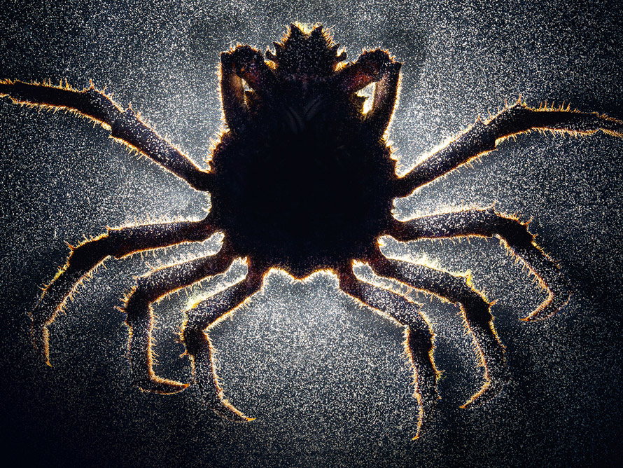

    

<b>Parasitic barnacle (<em>Heterosaccus californicus</em>) 
Sheep crab (<em>Loxorhynchus grandis</em>)</b> 
Photo by Anand Varma, "Mindsuckers" 
National Geographic (2014)

--- &twocolfull

## How may parasites evade coextinction?

*** =left

>"<b>Evolutionary rescue</b> occurs when adaptive evolutionary change restores positive growth to declining populations and prevents extinction" 
>
>  &mdash; Carlson, Cunningham, and Westley (2014)

*** =right
> - Be less virulent
> - Be less host-specific
> - Evolve faster

*** =fullwidth

 

--- &twocolfull

## How may parasites evade coextinction?

*** =left

>"<b>Evolutionary rescue</b> occurs when adaptive evolutionary change restores positive growth to declining populations and prevents extinction" 
>
>  &mdash; Carlson, Cunningham, and Westley (2014)

*** =right
- Be less virulent
- Be less host-specific
- Evolve faster

*** =fullwidth

 

## Problem

Cool to think about but hard to study

---

## Current methods

> - Distance-based / event-based
> - Do not incorporate reciprocal selective pressures

---

## Current methods

- Distance-based / event-based
- Do not incorporate reciprocal selective pressures
- Neglect antagonistic coevolution btwn parasites & their hosts

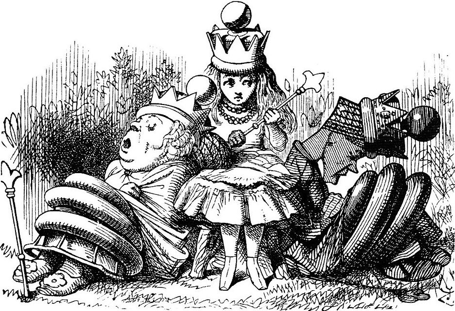

--- 

## Escape-and-radiate coevolution

Ehrlich and Raven (1964) Thompson (1994) 

--- &twocol

## Escape-and-radiate coevolution

> "In escape-and-radiate coevolution, coevolution happens at key moments to drive the evolution of plant defenses and insect counter-defenses, and then other speciation processes (e.g., allopatric speciation) come into play as plants and insects increase their geographic ranges or further subdivide resources."
>
>  &mdash; Althoff, Segraves, and Johnson (2014)

Ehrlich and Raven (1964) Thompson (1994) 

--- &twocol

## Escape-and-radiate coevolution

> "In escape-and-radiate coevolution, coevolution happens at key moments to drive the evolution of plant defenses and insect counter-defenses, and then other speciation processes (e.g., allopatric speciation) come into play as plants and insects increase their geographic ranges or further subdivide resources."
>
>  &mdash; Althoff, Segraves, and Johnson (2014)

*** {name: left}

<H3 align="left">Let's say we start with</H3>

Ehrlich and Raven (1964) Thompson (1994) 

--- &twocol

## Escape-and-radiate coevolution

> "In escape-and-radiate coevolution, coevolution happens at key moments to drive the evolution of plant defenses and insect counter-defenses, and then other speciation processes (e.g., allopatric speciation) come into play as plants and insects increase their geographic ranges or further subdivide resources."
>
>  &mdash; Althoff, Segraves, and Johnson (2014)

*** {name: left}

<H3 align="left">Let's say we start with</H3>

*** {name: right}
### Potential scenario
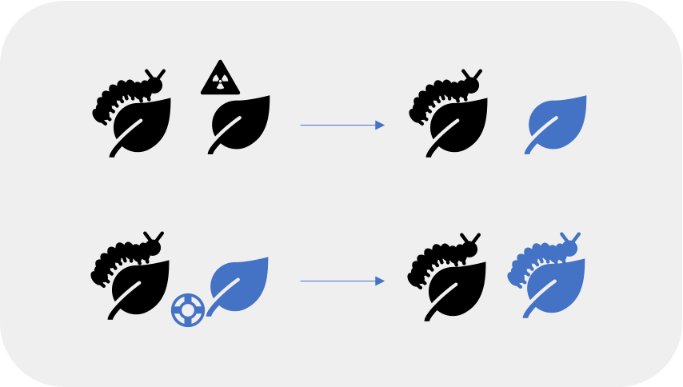

Ehrlich and Raven (1964) Thompson (1994) 

--- .segue h2 bg:darkslategray

## Developing a new model for a classic hypothesis

---

## Background

- Exciting progress exploring evolution of host-parasite interactions via ancestral host-repertoire reconstruction

## Problem

- Require a fixed host phylogeny
- Rely on phenomenological interpretations 

Braga et al (2020, 2021) Hardy (2016) Kaczvinsky & Hardy (2020)

---

## Objectives

> 1. Develop a novel quantitative model of escape-and-radiate coevolution
> 2. Generate testable macroevolutionary predictions of the consequences of antagonistic species interactions
> 3. Evaluate performance of methods to detect escape-and-radiate coevolution

---

## Quantitative model for escape-and-radiate 

- M1: Assume host speciation higher after parasite extinction
- M0: assume host diversification independent of parasite extinction

---

## Possible evolutionary events

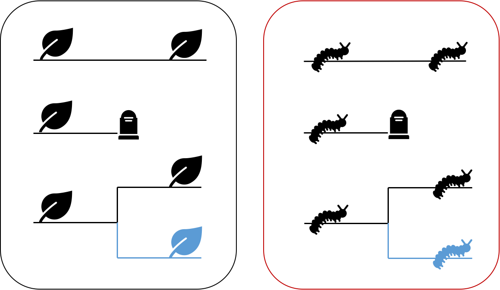

--- &twocol

## Possible coevolutionary scenarios

*** =left

- Successful host escape:  parasite extinction
- Successful parasite escape:  host-shift

*** =right

---

## Methods

> - New `R` package `coevolve`
> - Simulate host-parasite coevolution: `cophy`
> - Test driven development: `testthat` and `vdiffr`

Engelstadter & Fortuna (2019)

---

## Methods

Parameters of interest
- $\beta$: baseline parasite host shift rate
- $\nu$: parasite extinction rate
- $\kappa$: parasite speciation rate w/in hosts
- $\theta_S$: effect of parasite on host speciation
- $\theta_E$: effect of parasite on host extinction

--- &twocol

## Predictions

Simulations performed in `cophy` 
$\kappa = 0$, $\theta_S = 0.1$, $\beta = 0$ 
Top: $\nu = 0$ 
Bottom: $\nu = 2$

*** =left

- Greater host diversification following parasite extinction under escape-and-radiate 

*** =right

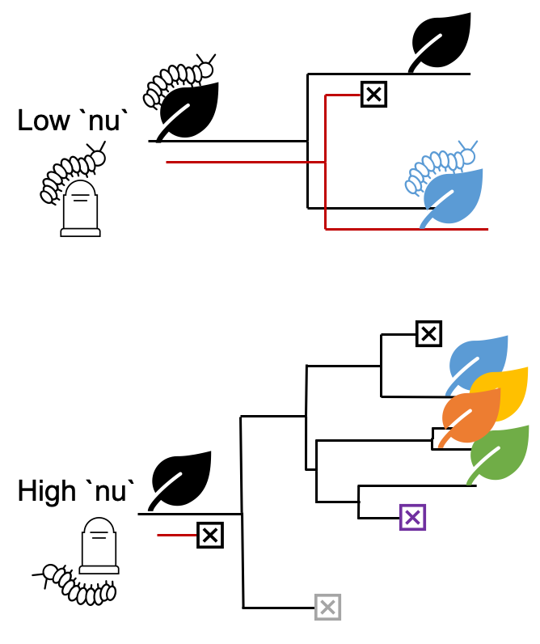

---

## Now what?

> 1. Simulate datasets under null and escape-and-radiate models 
> 2. Analyze datasets using coevolutionary methods
> 3. Identify which coevolutionary methods can tell them apart

---

## Now what?

1. Simulate datasets under null and escape-and-radiate models 
2. Analyze datasets using coevolutionary methods
3. Identify which coevolutionary methods can tell them apart

## Warning

- We're about to go through lots of methods, so hold tight!
- For each, I will
    - Describe method
    - Pose predictions

---

## Time-split

- Compare point statistics before and after "escape" events; compare overall summary statistics

    - Diversification rate ($r$) and relative extinction rate ($\epsilon$)
    - Lineage through time plots
    - Tree shape summary stats (e.g., spectral densities): `RPANDA`

Morlon et al (2016)

---

## Time-split: Predictions

- Similar $r$ but higher $\epsilon$ under escape-and-radiate
- More "bursts" evident in LTT plots
- Trees less balanced, more pectinate
- Escape-and-radiate events fall out as peaks in the spectral densities

--- 

## Cophylogeny reconstruction

<b>Distance-based</b>

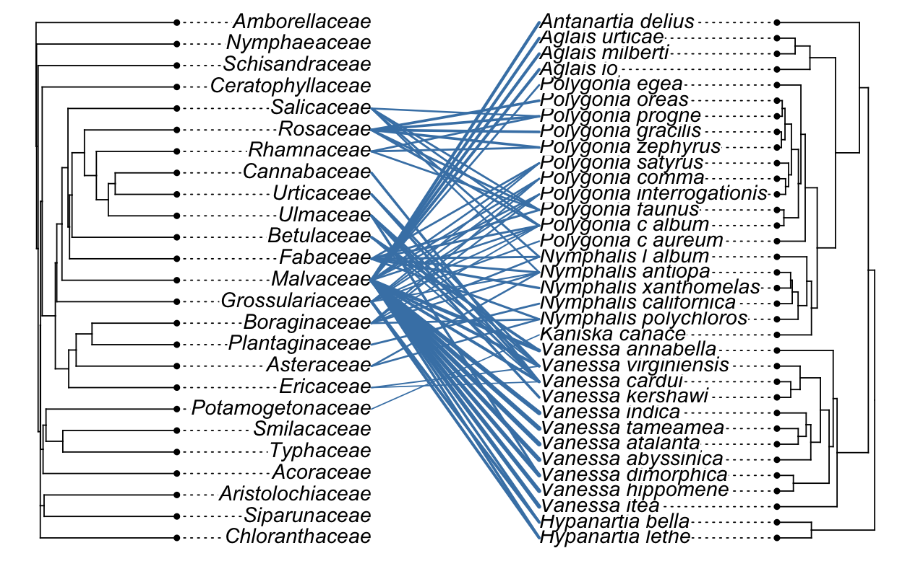

Balbuena et al (2013) Hutchinson et al (2017)

--- &twocol

## Cophylogeny reconstruction

<b>Event-based</b>

Engelstadter & Fortuna (2019) Conow et al (2010)

*** =left

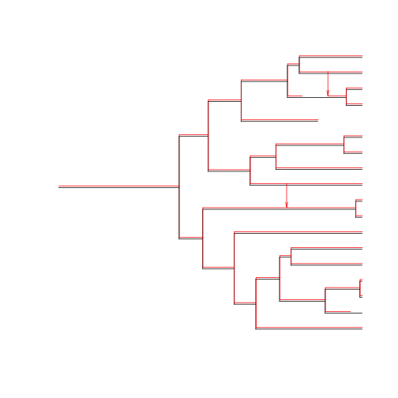

*** =right

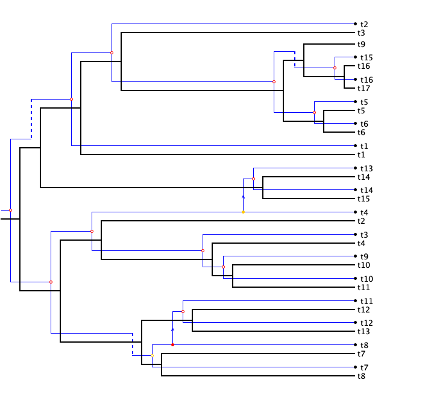

--- &twocol

## Cophylogeny reconstruction: Predictions

*** =left

<b>Distance-based</b>

- `paco` will infer greater phylogenetic congruence under escape-and-radiate

*** =right 

<b>Event-based</b>

- `Jane` will underestimate host-shift events under escape-and-radiate

---

## Gene tree-species tree evolution

- Based on Duplication-Transfer-Loss model 
- Duplication ~ parasite speciation Transfer ~ host-shift Loss ~ parasite extinction

Satler et al (2019) Dismukes et al (2020)

---

## Gene tree-species tree evolution

- Based on Duplication-Transfer-Loss model 
- Duplication ~ parasite speciation Transfer ~ host-shift Loss ~ parasite extinction

## Predictions

- DTL will underestimate transfer events under escape-and-radiate

Satler et al (2019) Dismukes et al (2020)

--- .segue h2 bg:darkslategray

## Quantifying the role of coevolution  in lineage diversification

---

## Background

> - Few phylogenetic studies interpret their observations through lens of coevolutionary theory
> - Coevolutionary theory &#8594; interesting predictions that can be tested at the macroevolutionary scale

---

## Hypotheses

> 1. Antagonistic coevolution promotes lineage diversification
> 2. Mutualistic coevolution does not promote, and may even restrict, the diversification of species

Yoder & Nuismer (2010)

---

## Good news

Many publicly available datasets exist to test these exciting predictions 

## Objective

Quantify the effect of coevolution on lineage diversification using phylogenetic meta-analysis

---

## Synthesis workflow

- Preferred Reporting Items for  
Systematic Review and  
Meta-Analysis (PRISMA) protocol
- `metagear`

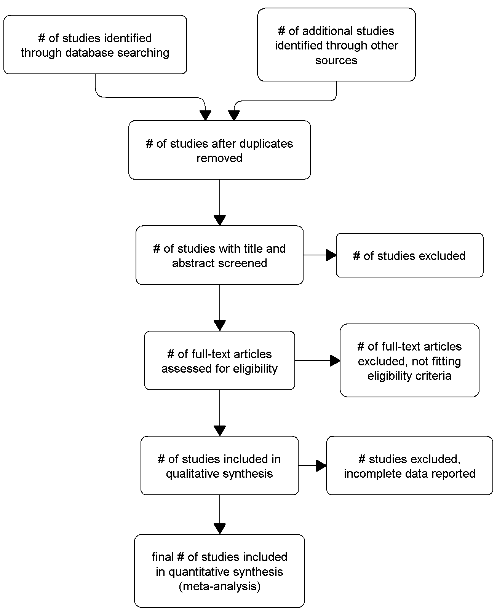

Moher et al (2015) Lajeunesse (2016)

---

## Scoping 

- Two monophyletic groups A and B 
- Open Tree of Life
- Interaction Web Database
- Global Biotic Interactions database

---

## Searching

- Develop search terms - yikes 
- Librarian &#10003;
- Validate search terms 

Zeng & Wiens (2021)

---

## Screening

- Recruit help!  (GEM3 SARE funding x2)
- `metagear`: `effort_distribute`, `abstract_screener`
- Follow criteria for conducting transparent meta-analyses on open data

Culina et al (2018) Lajeunesse (2016)

---

## Coding and extracting data

- Open Tree of Life in `R`: `rotl` 
- Phylogenetic heterogeneity!  Cool and also hard
- Divergence time estimates: TimeTree
- Phylogenetic similarity: `paco`

Michonneau, Brown, & Winter (2016) Kumar et al (2017) Hutchinson et al (2017)

---

## Coding and extracting data

- Estimate speciation and extinction rates: `GeoHiSSE`
- Repeat analyses in Zeng and Wiens (2021)

## Effect size

Binary log-response ratio 

$$\log_2(R)$$

$R$ is ratio of the two diversification rates

---

## Meta-analysis

- Goal of a meta-analysis: get average weighted effect size
- Evaluate homogeneity of effect sizes and test for bias

Lajeunesse (2011)

---

## Phylogenetic meta-analysis

- Additional source of bias: pooling effect size data from multiple taxa 
- Account for phylogenetic correlations among effect sizes: `PhyloMeta` and `metagear`
- Based on the generalized least squares (GLS) approach

Adams (2008) Lajeunesse (2009) Lajeunesse (2011) Lajeunesse (2016)

---

## Phylogenetic meta-analysis

Effects sizes are pooled, weighted by variance-covariance matrix $W$

$$
W = DPD
$$
$P$ diagonal matrix of phylogenetic correlations 

Lajeunesse (2009)

---

## Phylogenetic meta-analysis

Effects sizes are pooled, weighted by variance-covariance matrix $W$

$$
W = DPD
$$
$P$ diagonal matrix of phylogenetic correlations 

If $P$ is identity matrix, then studies are independent

Lajeunesse (2009)

---

## Challenge

- We have two trees

## Possible solutions

- Make one tree and account for divergence between interacting phylogenies?
- Extend framework to include cophylogenetic reconciliations?

---

## Focus on one partner

- Test importance of type of interaction over other characteristics as predictor of diversification
- Phylogenetic divergence btwn interacting phylogenetics, taxonomic identity, relationship to partner, relative extinction rates

## Predictions

- Parasitism affects diversification differently in plants than in animals
- Parasitism affects diversification differently in hosts than in parasites 

Carmona, Lajeunesse, & Johnson (2011)

--- .segue h2 bg:darkslategray

## Software process meets the scientific method

---

## A train-the-trainer model of computational empowerment for biologists

> - Technology &#8594; data!
> - Cumbersome datasets
> - Foundational computational tools &#10003;
> - Now what &#63;

---

## Objective

To specifically tailor development of a new <b>Vertically Integrated Project (VIP) course</b> focusing on how software process tools such as <em>version control</em> and <em>test-driven development</em> can help meet the needs of researchers while supporting the reproducibility of science

---

## Objective

To specifically tailor development of a new <b>Vertically Integrated Project (VIP) course</b> focusing on how software process tools such as <em>version control</em> and <em>test-driven development</em> can help meet the needs of researchers while supporting the reproducibility of science

## Overview

> - Work with EPSCoR researchers to identify a suitable problem and dataset
> - Create modules to walk through solving problem using software process
> - Self-sustaining by design
> - Help train a diverse workforce

---

## VIP   Phases 

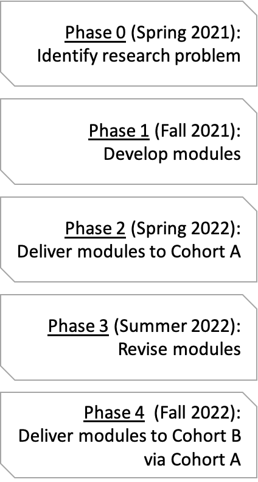

---

## Conceptual framework

---

## Learning objectives

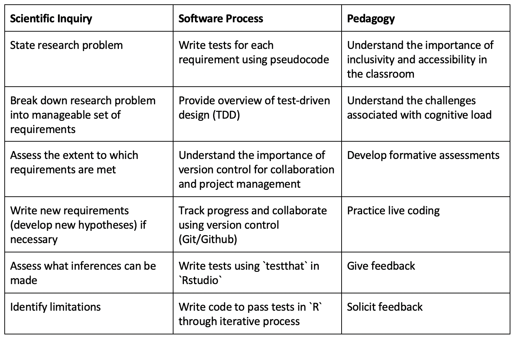

---

## Recruitment plan

- Cohort A
    - Certified Carpentry instructors
    - IMCI-spnosored Carpentries workshops
    - Flyer distributed via COGS, IBEST, IMCI, CNR, EPSCoR GEM3
- Cohort B
    - Undergraduate research
    - SSS-TRiO
    - SACNAS
    - Palouse Pathways

---

## Research goals

- Consult with EPSCoR affiliates to identify a suitable research problem to tackle via this course module

> - Erect a novel pedagogical framework for teaching computational skills to biological researchers
> - Science education paper introducing the new train-the-trainer model, how it was implemented, and how it went

---

## Data acquisition

- Survey participants' confidence before and after course in 
    - Writing code to analyze large, cumbersome datasets
    - Teaching computational skills to novices and intermediate learners 

> - Collaborate with others to identify other metrics for comparison (e.g., extent to which learning objectives met) 
> - Examine the reproducibility of code
> - Assess extent to which product meets the desired requirements 

---

## Ethics

- IRB (Human Research Protections) Coordinator at UI
- Likely will fall under Exempt Category 1 or 2
- Human subjects training
- All research data will be handled and stored securely
- All participation will be voluntary (Informed Conent Form) 
- Responsible Conduct of Research training 

--- .segue h2 bg:darkslategray

## Considerations

---

## Funding

> - Secured

> - Fending

> - Promising

---

## Future directions

> 1. Assess the extent to which, and under what circumstances, escape-and-radiate coevolution emerge across the tree of life
> 2. Extending `coevolve` to include additional models

--- .segue h2 bg:darkslategray

## Summary

---

## Intellectual merit

> 1. First-author paper evaluating relative performance of methods in detecting escape-and-radiate coevolution
> 2. Phylogenetic meta-analysis quantifying role of coevolution on lineage diversification
> 3. Pedagogical innovation paper introducing train-the-train model of computational empowerment for biologists

---

## Broader impacts

> 1. `R` package for simulating and detecting escape-and-radiate coevolution
> 2. Cophylogenetic comparative framework
> 3. Empowerment of more diverse and inclusive professoriate
> 4. Reproducibility of science 
> 5. Increased computational literacy of biologists
> 6. Independent research experiences for 3 undergraduates
> 7. Doctoral training for me

--- &twocol

## Acknowledgements 

*** {name: left}
<b>Committee</b> 
Luke Harmon 
Christine Parent 
Aleta Quinn 
Jack Sullivan

<b>Rockstar labmates</b> 
Kristen Martinet, Orlando Schwery

<b>BCB</b> 
Lisha Abendroth 
Dave Tank

*** {name: right}
<b>Resources</b> 
NSF GRFP, Idaho EPSCoR GEM3 VIP 
UI IBEST CRC 
Raven Scholars, CDAR, CTC, COGS

<b>Snorks</b> 
Kelly Martin, Ian Oiler, Malia Santos, David Sneddon

<b>Co-working friends</b> 
Chava Castaneda, Clint Elg, Yesol Sapozhnikov, Courtney Schreiner, Hannah Smith, Amanda Stahlke

--- {
 tpl: thankyou,
 social: [{title: email, href: "sipl0809@vandals.uidaho.edu"}]
}

## Thank You

 
 
